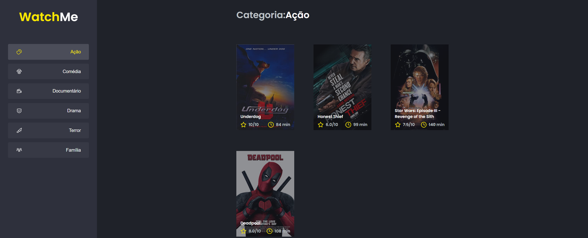

<h1 align="center">
  
</h1>


<h3 align="center">
  Desafio 02 - Componentizando a aplicação
</h3>


<p align="center">
  <a href="https://rocketseat.com.br">
    
  </a>
</p>

<p align="center">
 <a href="#-sobre">Sobre</a> |
 <a href="#-requisitos">Requisitos</a> | 
 <a href="#-tecnologias">Tecnologias</a> | 
 <a href="#%EF%B8%8F-como-executar">Como executar</a> | 
 <a href="#-licença">Licença</a>
</p>


## 🚀 Sobre
<p align="center">
  
</p>

Esse é um primeiro desafio do ignite Front-End, que tem por objetivo componentizando a aplicação. 

A aplicação já está totalmente funcional mas grande parte do seu código está diretamente no arquivo `App.tsx`. Para resolver isso da melhor forma, é necessário dividir a aplicação em **pelo menos** duas partes principais: sidebar e o conteúdo principal que possui o header e a listagem de filmes.

- A aplicação possui apenas uma funcionalidade principal que é a listagem de filmes;
- Na sidebar é possível selecionar qual categoria de filmes deve ser listada;
- A primeira categoria da lista (que é "Ação") já deve começar como marcada;
- O header da aplicação possui apenas o nome da categoria selecionada que deve mudar dinamicamente.

## 📚 Requisitos
- Ter [**Git**](https://git-scm.com/) para clonar o projeto.
- Ter [**Node.js**](https://nodejs.org/en/) instalado.

## 🚀 Tecnologias
- [ReactJS](https://github.com/facebook/react)
- [TypeScript](https://github.com/microsoft/TypeScript)


## ⚙️ Como executar

```bash

    # Clonar o repositório
    $ git clone https://github.com/claudianopl/watchme-ignite.git

    # Navegar para o diretório
    $ cd watchme

    # Instalar as package
    $ yarn

    # Rodar o Json-Server
    $ yarn server

    # Rodar o projeto
    $ yarn dev
```


## 📝 Licença
Esse projeto está sob a licença MIT. Veja o arquivo [LICENSE](LICENSE.md) para mais detalhes.

---
Feito com 💜 by Claudiano Lima

<p align="right">
  
  &nbsp;&nbsp;&nbsp;&nbsp;&nbsp;&nbsp;
  
</p>
